# Virtual BOX - Primeros pasos
 
  - [**¿Qué es Virtual Box?**](#qué-es-virtual-box)
  - [**¿Por qué y para qué?**](#por-qué-y-para-qué)
  - [**Instalación y configuración de nuestra primera máquina.**](#instalación-y-configuración-de-nuestra-primera-máquina)
  - [**Instalación del S.O**](#instalación-del-so)
  - [**¿Qué son las Guest Additions?**](#qué-son-las-guest-additions)
  

## **¿Qué es Virtual Box?**

Es un software de virtualización, también denominado hipervisor de tipo 2. Se utiliza para generar virtualizaciones de sistemas operativos dentro de un ordenador físico existente, generándose lo que se conoce como máquinas virtuales.

Una máquina virtual es un software que simula un sistema de computación y que tiene la capacidad de ejecutar programas como si fuera un ordenador real. Normalmente a este software se le define como «un duplicado eficiente y asilado de una máquina física«. El término actualmente incluye también a máquinas virtuales que no tienen equivalencia directa con un hardware físico.

## **¿Por qué y para qué?**

Esencialmente se utiliza para la virtualización de sistemas operativos que no podamos o queramos ejecutar en nuestro equipo informático. Permite trabajar con los sistemas operativos con normalidad, como si los instaláramos en nuestro equipo. Podemos decir que son una caja aislada dentro de nuestro ordenador, nada de dentro saldrá y genera problemas con nuestro equipo principal.

## **Instalación y configuración de nuestra primera máquina.**

En mi caso, he descargado la herramienta a través de la web oficial (https://www.virtualbox.org/), la versión 6.1

Una vez tengamos la aplicación instalada, iremos a crear una nueva máquina pinchando sobre **NUEVA**.

Elegimos el nombre que querrámos para la máquina (en mi caso le pondré el nombre de la versión del S.O que utilizaré), la ruta donde queremos instalar la máquina y el sistema operativo.

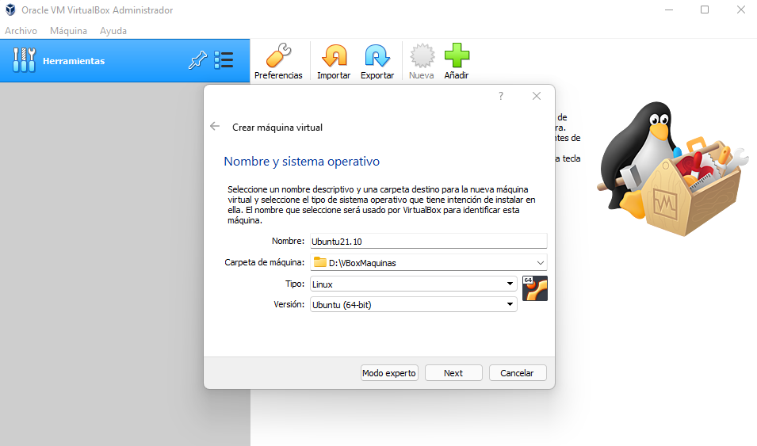

Vamos a utilizar la máquina con 4GB de memoria RAM.

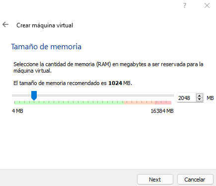

Seleccionamos el tipo de disco (30GB, más adelante convertiremos el disco en SSD).

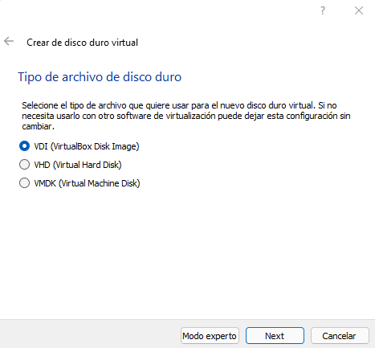
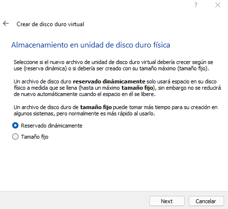

Ahora ya tenemos creada nuestra máquina.

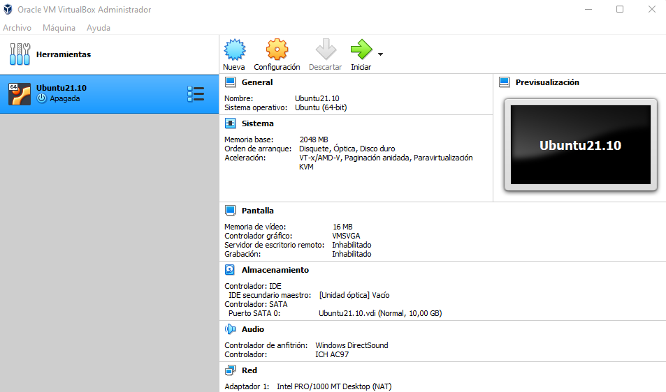

Convertimos el disco en SSD clickando el siguiente recuadro:

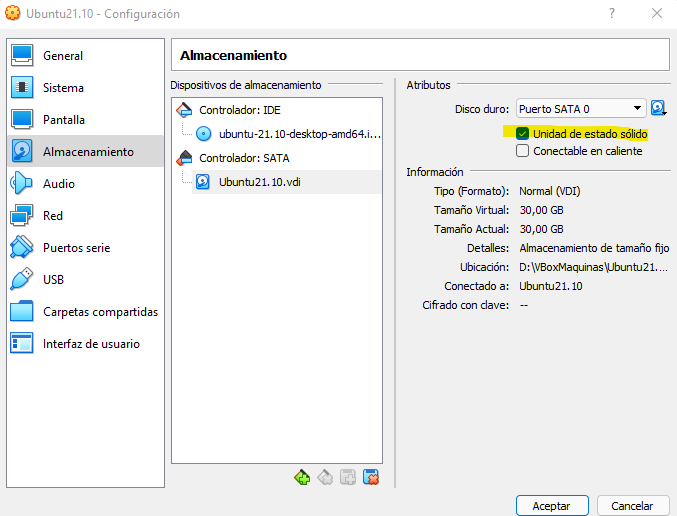

Si queremos poder compartir bidireccionalmente el portapapeles de la máquina real tanto como de la virtual, debemos ir a Configuración>General y activarlo.

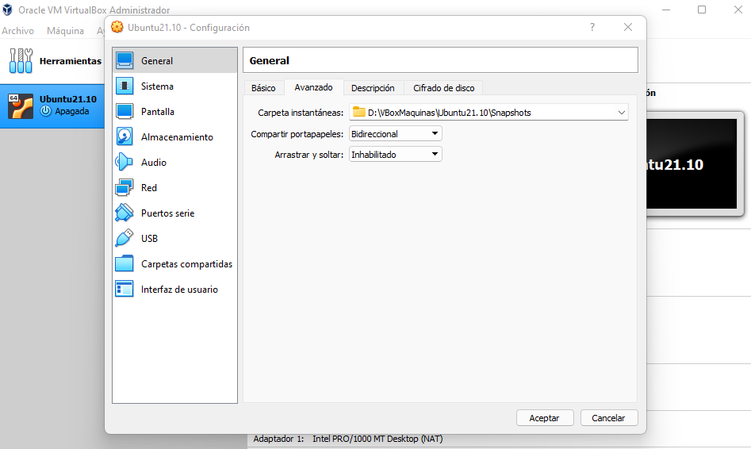

También, para disfrutar de internet en la máquina virtual debemos habilitar el adaptador puente en Configuración>Red.

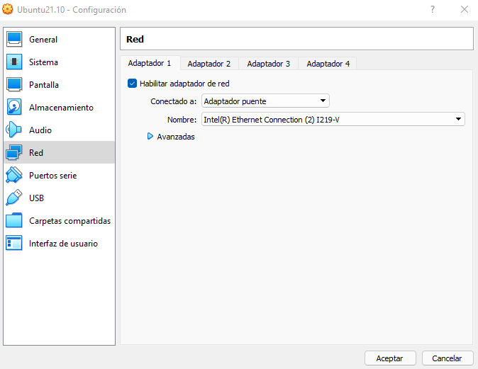

La Extensible Firmware Interface (EFI, lit. «interfaz de firmware extensible») fue desarrollada inicialmente por Intel en el 2002. La UEFI puede proporcionar menús gráficos adicionales e incluso proporcionar acceso remoto para la solución de problemas o mantenimiento.

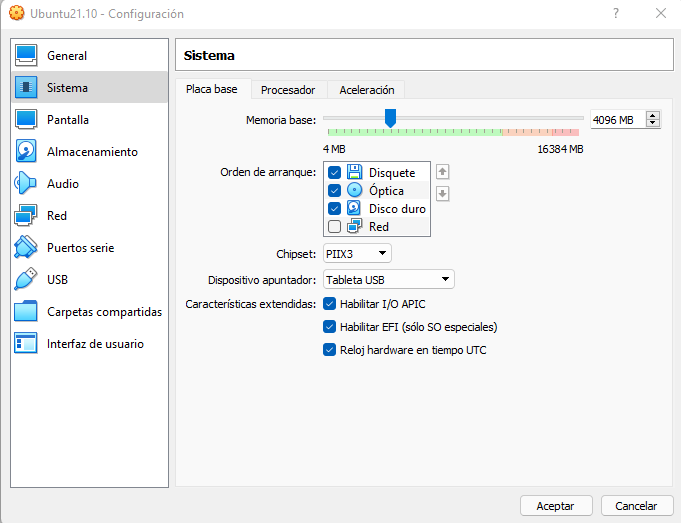

Por último, lo más importante. La imagen ISO del sistema operativo que deseamos usar. En este caso he descargado Ubuntu 21.10 a través de https://releases.ubuntu.com/21.10/ y la añadimos como Controlador: IDE.

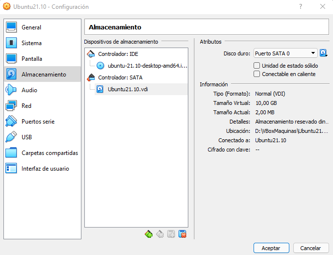

## **Instalación del S.O**

Tenemos todo listo para iniciar la máquina.

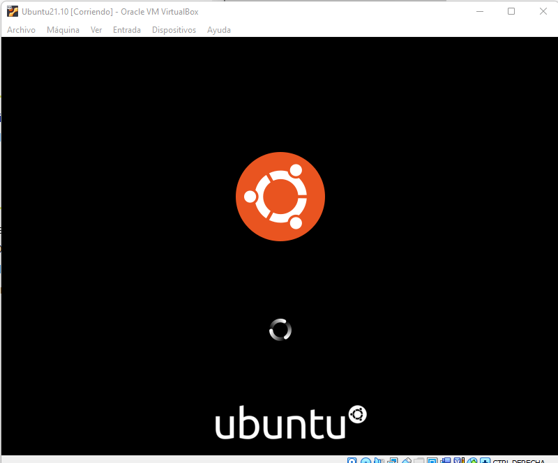

Elegiremos el idioma en el que querramos trabajar.

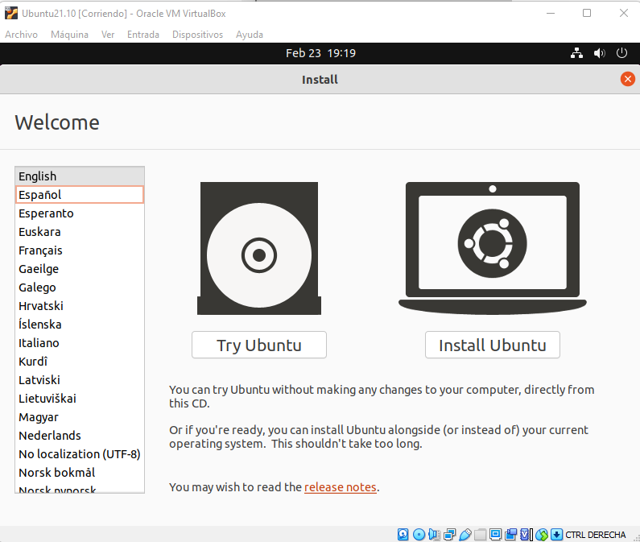

Elegimos el tipo de instalación, que en este caso lo dejo por defecto.

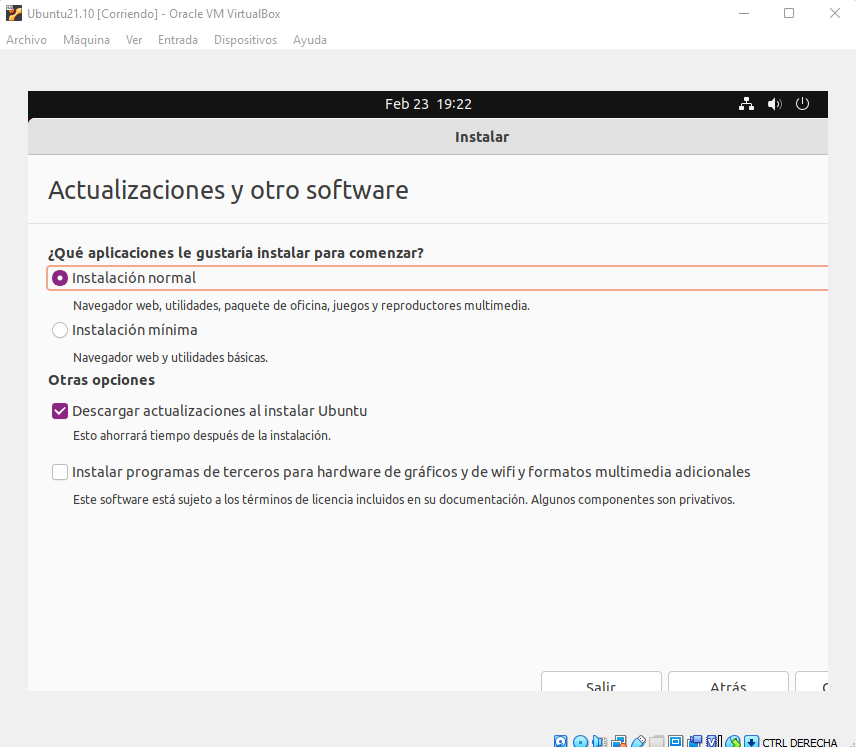

Instalamos el S.O en el disco que hemos creado anteriormente al generar la VDI.

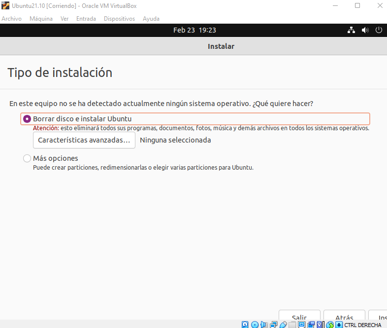

Nos pedirá reiniciar la máquina tras completarse la instalación.

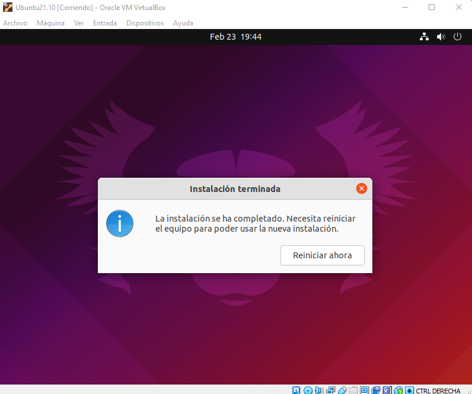

Deberemos retirar la imagen ISO de la máquina, ya que el sistema ha sido instalado correctamente.

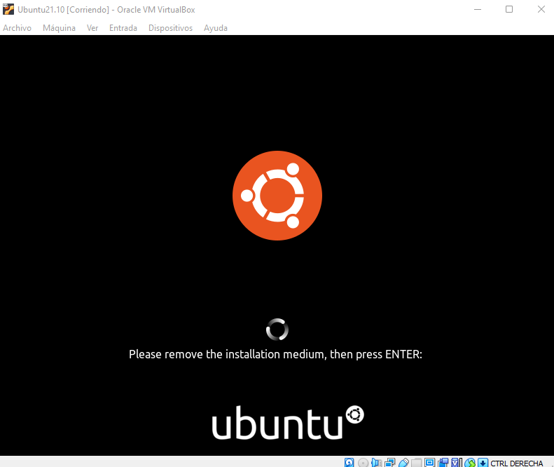
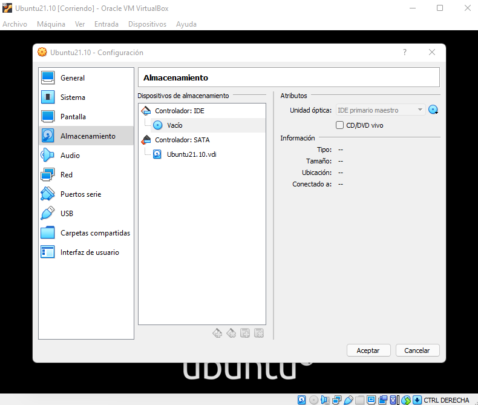

Por último, como recomendación, instalaremos las "Guest Additions" de Virtual Box.

## **¿Qué son las Guest Additions?**
VirtualBox Guest Additions es una colección de controladores de dispositivos y aplicaciones de sistema diseñadas para lograr una mayor integración entre los sistemas operativos host e invitado. Ayudan a mejorar el rendimiento interactivo general y la facilidad de uso de los sistemas invitados. Fácil integración del puntero del mouse.

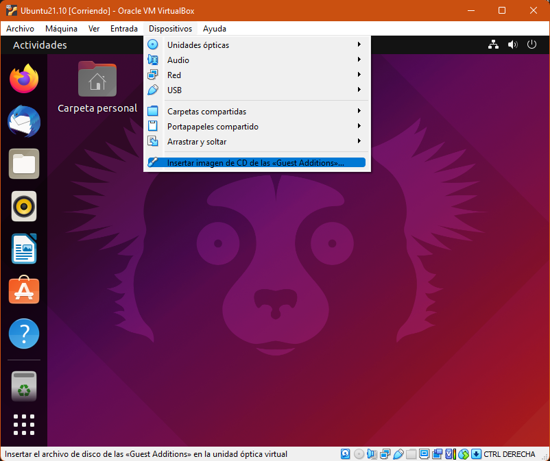
